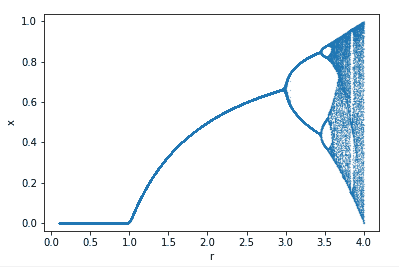
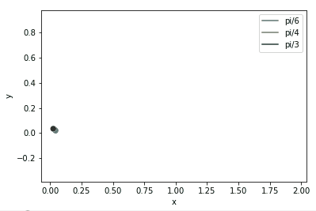
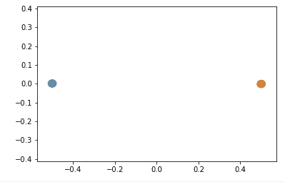
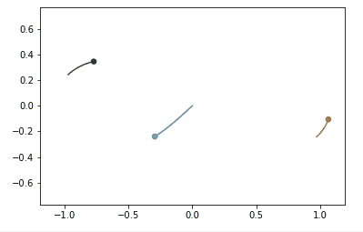

# PHYS:150 Introduction to Programming for Physics: A Freshmen Class

Most of the lecture notes are written in Jupyter Notebooks and are fully interactive on google colab.

## Lectures

- [lecture 1: introduction to programming in physics](./lecture/lecture%2001.pptx)
- lecture 2: [demonstrations](./lecture/lecture%2002%20demo.ipynb) and software installation 
- [lecture 3: markdown and LaTeX](./lecture/lecture%2003%20markdown.ipynb)
- [lecture 4: scalar variables](./lecture/lecture%2004%20scalar%20variable.ipynb)
- [lecture 5: branching](./lecture/lecture%2005%20branching.ipynb)
- [lecture 6: Loop](./lecture/lecture%2006%20loop.ipynb)
- [lecture 7: Containers](./lecture/lecture%2007%20container.ipynb)
- [lecture 8: Motion (1D)](./lecture/lecture%2008%201D_motion.ipynb)
- [lecture 9: Function](./lecture/lecture%2009%20function.ipynb)
- [lecture 10: Class](./lecture/lecture%2010%20Class.ipynb)
- [lecture 11: Module](./lecture/lecture%2011%20Module.ipynb)
- [lecture 12: Plot and Animation](./lecture/lecture%2012%20matplotlib.ipynb)
- [lecture 13 data: Saving and Loading Data](./lecture/lecture%2013%20data.ipynb)
- [lecture 14: Planetary Motion](./lecture/lecture%2014%202D_motion.ipynb) (The file is too big to show in github. Please download the notebook.)
- [lecture 15: Optimization and Equation Solving](./lecture/lecture%2015%20optimization.ipynb)
- [lecture 16: simple iteration and complex phenomena](./lecture/lecture%2016%20iteration.ipynb)

## Gallery

After taking the course, you can also make these cool animations as well and learn the physics behind.

