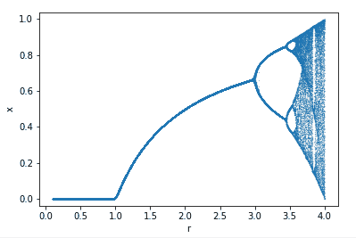
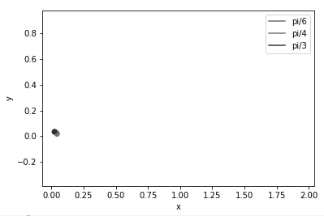
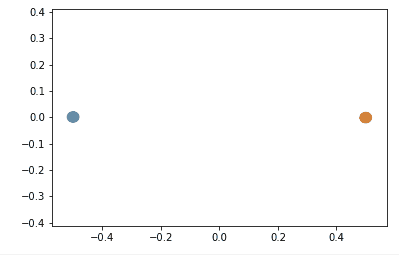
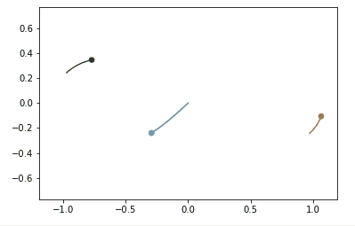
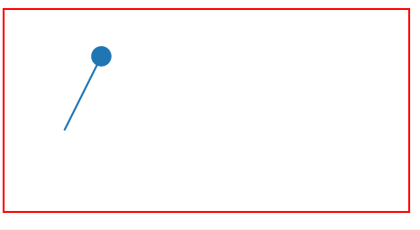

# PHYS:150 Introduction to Programming for Physics: A Freshmen Class

Most of the lecture notes are written in Jupyter Notebooks and are fully interactive on google colab.

## Lectures

- [lecture 1: introduction to programming in physics](./lecture/lecture%2001.pptx)
- lecture 2: demonstrations and software installation
- [lecture 3: markdown and LaTeX](./lecture/lecture%2002%20markdown.ipynb)
- [lecture 4: scalar variables](./lecture/lecture%2004%20scalar%20variable.ipynb)
- [lecture 5: branching](./lecture/lecture%2005%20branching.ipynb)
- [lecture 6: Loop](./lecture/lecture%2006%20loop.ipynb)
- [lecture 7: Containers](./lecture/lecture%2007%20container.ipynb)
- [lecture 7: Motion (1D)](./lecture/lecture%2008%201D_motion.ipynb)

## Gallary

After taking the course, you can aslo make these cool animations as well and learn the physics behind.

