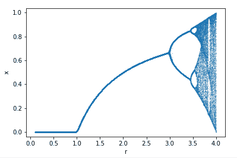
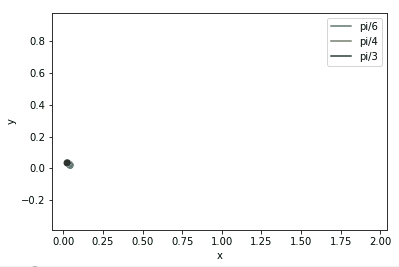
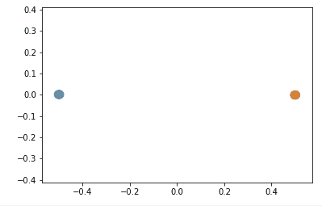
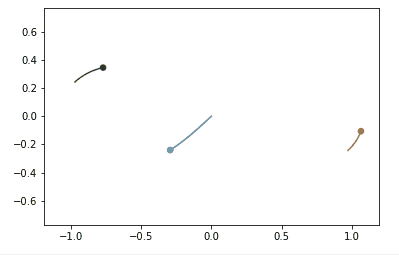
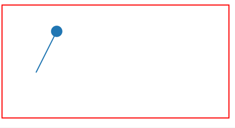

# PHYS:150 Introduction to Programming for Physics: A Freshmen Class

Most of the lecture notes are written in Jupyter Notebooks and are fully interactive on google colab.

## Lectures

- [lecture 1: introduction to programming in physics](./2026/lecture-01-introduction.ipynb)
- [lecture 2: programming for physics](./2026/lecture-02-programming-for-physics.ipynb)
- [lecture 3: markdown](./2026/lecture-03-markdown.ipynb)

## Gallery

After taking the course, you can also make these cool animations as well and learn the physics behind.

